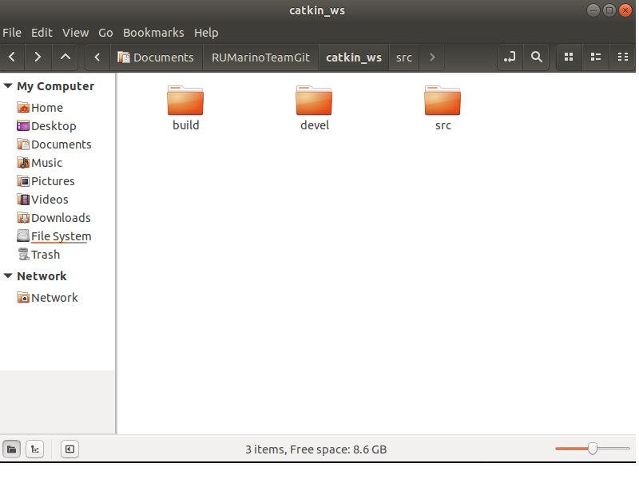
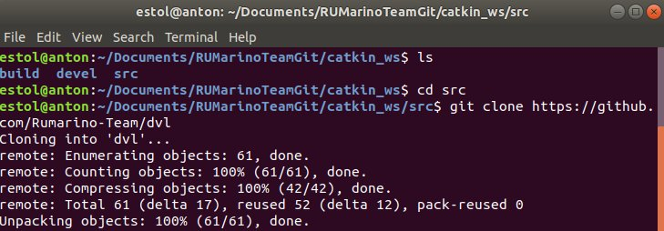
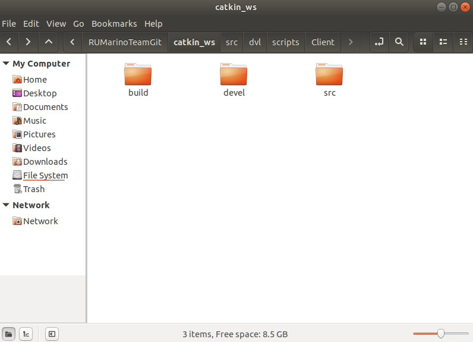
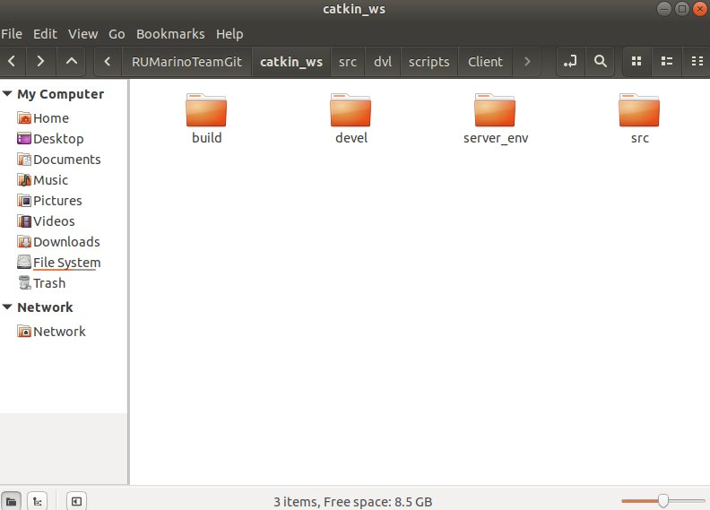

# Rumarino ROS Doppler Velocity Logger Package

## Installation

### ROS Installation
You must already have a catkin workspace to be able to add the package into the src folder.

In this example the root folder is named catkin_ws (it can have another name, does not have to be the same, but keep in mind to replace the your root folder name whenever the folder catkin_ws is used)



The default catkin workspace will usually have three folders, build, devel, src.

<br/>
Go into the src directory and perform git clone.

  ```
  cd src
  git clone https://github.com/Rumarino-Team/dvl
  ```



Change back to the root of the catkin ws.

`cd ..`

Build the package with catkin make.

`catkin_make`

Source the built package in the terminal.

`source devel/setup.sh`

### Python2 Installation

Using Ubuntu 18.04.6 by default the command `python` and `pip` refers to the python2.7 version.

Install requirements for python2 with pip:

`pip install -r src/dvl/script/scripts/Client/requirements.txt`

### Python3 Installation
To install the components needed for python3 the packages `python3-pip` and `python3-venv`.

Use the command:

`sudo apt install python3-pip`
`sudo apt install python3-venv`


This package lets us create virtual environments for python3. In the root folder of the workspace create a new virtual environment with the following command:

`python3 -m venv <env_name>`

where <env_name> is the name of the environment. (It can have any name) In this example the virtual environment will be named `server_env`, to create the environment with this name the following command is used:

`python3 -m venv server_env`

Root workspace folder before creating virtual environment:


Root workspace folder after create virtual environment:


Activate the virtual environment with:

`source server_env/bin/activate`

After activating the virtual environment the terminal should look something like this:


Install the python3 dependencies with pip into the virtual environment:

`pip install -r src/dvl/src/lib/Server/requirements.txt`


### Install Wayfinder library
The Teledyne DVL Wayfinder library is included in the repository. With the virtual environment active install the library using pip.

`pip install src/dvl/src/lib/Wayfinder`

